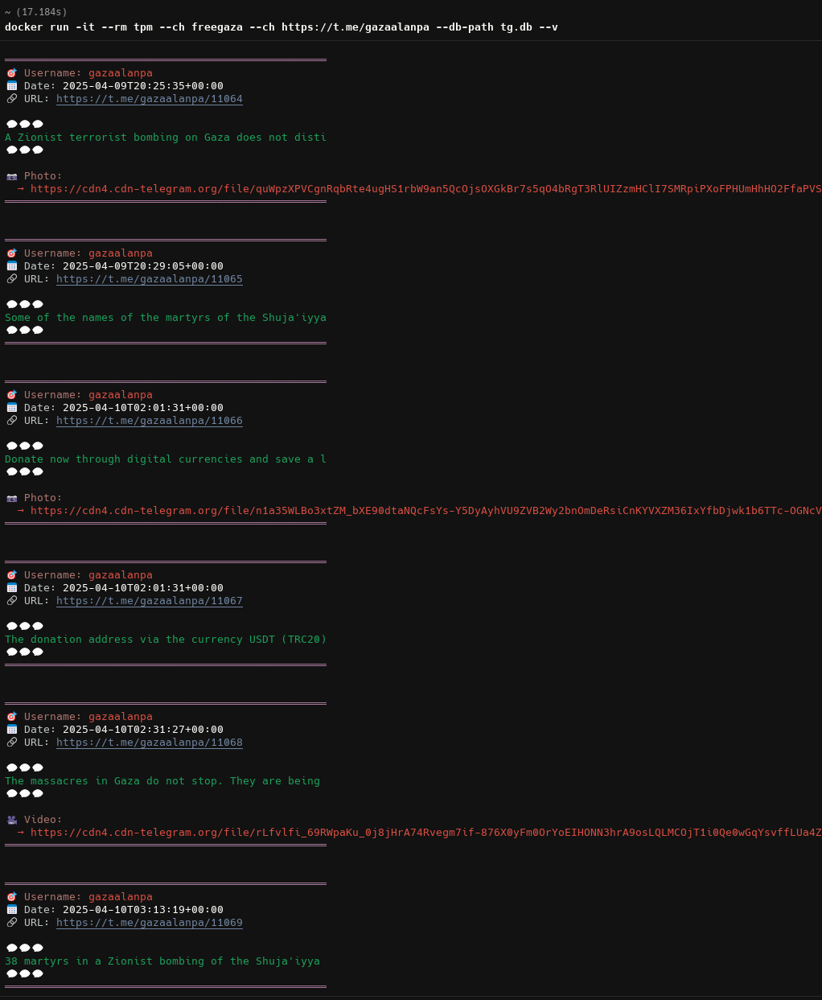

# Telegram Channels Monitor


Tool for monitoring public Telegram channels available in WEB preview mode

## 🌟 Features
1. [x] Parsing recent messages from public Telegram channels
2. [x] Extracting metadata and media attachments
3. [x] Storing data in SQLite database
4. [x] Support for forwarded messages and replies
5. [x] Configurable data collection parameters


## 🛠 Installation
1. Ensure Python 3.12+ is installed (recommendation)
2. Clone repository
```bash
   git clone 'https://github.com/aIligat0r/tpm.git'
```
or
```bash
pip install telegram-pm
```

## ⚙️ Configuration
Configurations (file `.env` or `tpm/config.py`)

Parsing configurations:
* `TELEGRAM_PARSE_REPEAT_COUNT` - Number of requests (default `5`). 20 messages per request. (1 iter - last 20 messages)
* `TELEGRAM_SLEEP_TIME_SECONDS` - Number of seconds after which the next process of receiving data from channels will begin (default `60` seconds)
* `TELEGRAM_SLEEP_AFTER_ERROR_REQUEST` - Waiting after a failed requests (default `30`)

HTTP configurations:
* `HTTP_RETRIES` - Number of repeated request attempts (default `3`)
* `HTTP_BACKOFF` - Delay between attempts for failed requests (default `3` seconds)
* `HTTP_TIMEOUT` - Waiting for a response (default `30` seconds)

## 🚀 Usage

#### 1. Build application:

Build docker image:
```bash
docker build -t telegram_pm .
```
Create poetry env:
* Install poetry:
```bash
pip install poetry
```
* Create poetry env and install packages:
```bash
poetry install
```

#### 2. Launching the app

| Options                           | Description                                                           | Required                                                       |
|-----------------------------------|-----------------------------------------------------------------------|----------------------------------------------------------------|
| `--db-path`                       | Path to the base (if not, it will be created)                         | ❌ required                                                     |
| `--channels-filepath`/`--ch-file` | File of channel usernames (file where in each line Telegram username) | ❌ required (or usernames `--channel`/`--ch`)                   |
| `--channel`/`--ch`                | List of usernames that are passed by the parameter                    | ❌ required (or file of channels `--channels-filepath`/`--chf`) |
| `--verbose`/`--v`                 | Verbose mode                                                          | ➖                                                              |
| `--help`/`--h`                    | Help information                                                      | ➖                                                              |

**Poetry**:
```bash
poetry run telegram_pm --ch freegaza --ch BREAKINGNewsTG --db-path .\tg.db --v
```
or
```bash
poetry run telegram_pm --channels-filepath /path/to/monitoring_usernames.txt --db-path .\tg.db
```
**Docker**:
```bash
docker run -it --rm telegram_pm --ch freegaza --db-path test_tg.db --v
```
or (if you want to transfer usernames in a file, then you need to mount the paths)
```bash
$ mkdir ~/tpm_data/  # create a folder for data
$ cp /path/to/channel/usernames.txt ~/tpm_data/usernames.txt  #  copy the file with the user names to the previously created folder
$ chmod 666 ~/tpm_data_dir/telegram_messages.sqlite && chmod 666 ~/tpm_data_dir/usernames.txt  # grant access to use this folder from the container
```
```bash
docker run -it --rm \
    -v ~/tpm_data_dir/telegram_messages.sqlite:/data/telegram_messages.sqlite \
    -v ~/tpm_data_dir/usernames.txt:/data/usernames.txt \
    telegram_pm --db-path /data/telegram_messages.sqlite --chf /data/usernames.txt
```
## 🗃️ Database Structure

The tables will be named as usernames. Each table is a username that was passed in the running parameters.

| Field                 | Type                              | Description                                              |
|-----------------------|-----------------------------------|----------------------------------------------------------|
| `id`                  | **INTEGER**                       | Channel ID                                               |
| `url`                 | **TEXT**                          | Message URL                                              |
| `username`            | **TEXT**                          | Channel username                                         |
| `date`                | **TEXT** _(ISO 8601)_             | Message date                                             |
| `text`                | **TEXT**                          | Message text                                             |
| `replied_post_url`    | **TEXT**                          | Replied message URL                                      |
| `urls`                | **JSON**                          | URLs from text                                           |
| `photo_urls`          | **JSON**                          | Photo URLs                                               |
| `video_urls`          | **JSON**                          | Video URLs                                               |
| `created_at`          | **CURRENT_DATETIME** _(ISO 8601)_ | Record creation time                                     |
| `url_preview`         | **TEXT**                          | Text from preview URL                                    |
| `round_video_url`     | **TEXT**                          | URL to round video message                               |
| `files`               | **JSON**                          | List of file names and their description                 |
| `tags`                | **JSON**                          | List of tags from a message body                         |
| `forwarded_from_url`  | **TEXT**                          | URL of the channel from which the message was forwarded  |
| `forwarded_from_name` | **TEXT**                          | Name of the channel from which the message was forwarded |


## ⚠️ Limitations
Works only with public channels

## 🧮 Example of work
**_Verbose mode:_**



**_View database_**


## 📜 License
MIT License
